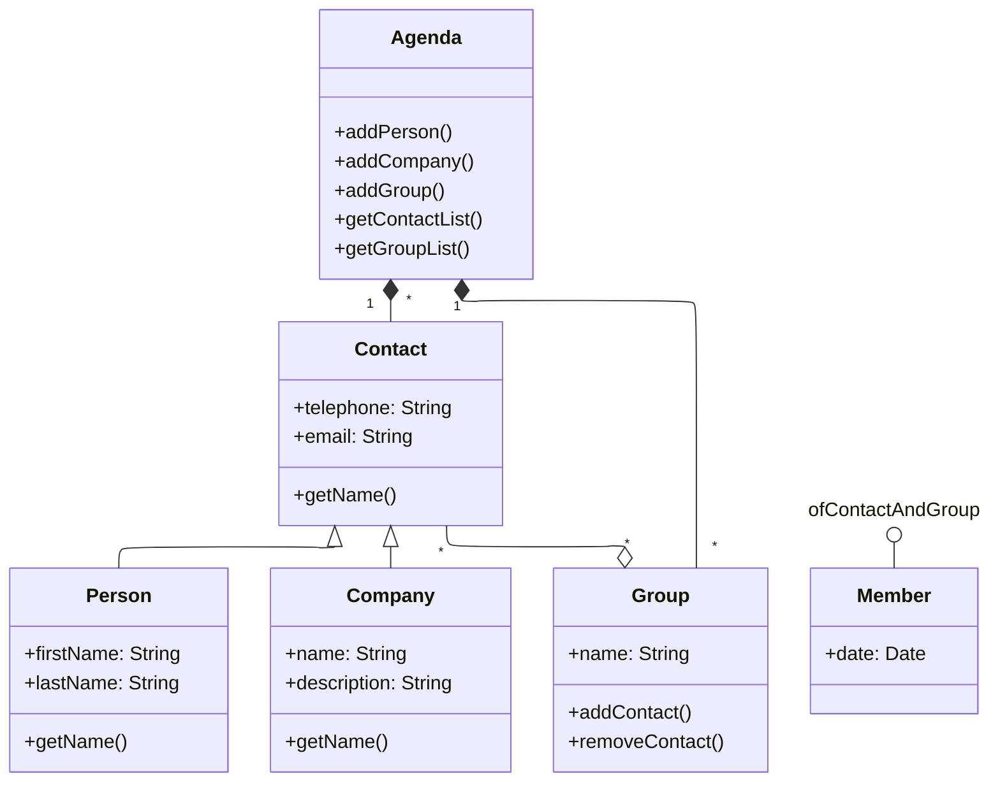

# Ejercicio 1 - 2ª parte

Modificar la implementación realizada en la primera parte del ejercicio para incluir la fecha en la que un contacto se agrega a un grupo de contactos como miembro del grupo.

a. Añadimos una clase de asociación a la que llamaremos `Member` que tendrá una fecha de tipo `Date`. Vamos a usar la clase `LocalDateTime` para implementar la fecha.

b. Añadimos en el `main` el código necesario para imprimir por pantalla la fecha en la que se agregó al grupo “trabajo” uno de los contactos de la agenda (paso 3 del punto m). El código deberá añadirse justo antes de borrar el contacto (paso 6 del punto m). El formato en el que se debe mostrar la fecha es el siguiente: "dd-MM-yyyy".