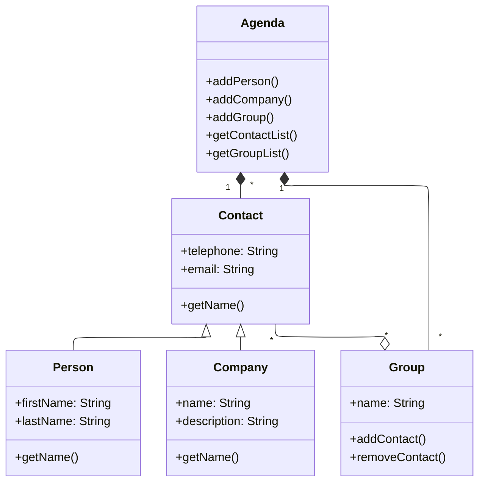

# Ejercicio 1 - 1ª parte

Implementar con IntelliJ un pequeño prototipo (en inglés) de una aplicación de agenda de contactos a partir del siguiente diagrama de clases.

### Pasos:

a. Creamos un nuevo proyecto Java llamado `AgendaApp`. Al módulo que se crea por defecto lo llamamos `agenda`.

b. Dentro de la carpeta `src` creamos un paquete llamado `org.ulpgc.is1`. Dentro de ese paquete creamos otros dos paquetes al mismo nivel llamados `control` y `model`. Movemos al paquete `control` la clase `Main` que se nos creó por defecto al crear el proyecto. En el paquete `model`, creamos todas las clases de nuestro diagrama de clases: `Agenda`, `Group`, `Contact`, `Person`, `Company` y `Address`.

c. Utilizaremos la palabra clave `abstract` para indicar las clases abstractas (en este caso, `Contact`) y en las clases que heredan de otras clases, indicaremos la herencia mediante `extends` (`Person` y `Company` heredan de `Contact`).

d. En cada clase incluiremos los atributos identificados. Hemos de tener en cuenta que, además de los atributos indicados explícitamente, las asociaciones, agregaciones o composiciones llevan implícitos otros atributos.

e. En las clases que tienen una composición o agregación de instancias de otra clase, utilizaremos atributos de tipo `List` para representar esas relaciones. Para poder usarlo, es necesario incluir la sentencia `import java.util.List` al comienzo. Se utilizará la implementación `ArrayList`.

f. En la clase `Contact` incluiremos un método `setAddress` para fijar la dirección.

g. Crearemos los constructores para las diferentes clases.

h. En `Contact` incluiremos un getter para el teléfono y el email y un getter abstracto para el `Name`. Será abstracto porque es diferente según sea una persona o una empresa. 

i. Podemos incluir también los getters y setters que faltan.

j. Crearemos los métodos necesarios para añadir elementos a una composición o agregación.

k. Crearemos los métodos para añadir elementos a la agenda y a los grupos.

l. Podemos crear los métodos para quitarlos.

m. Para probar, en el `main`, añadiremos el código que haga lo siguiente:
    1. Crear dos contactos en la agenda de tipo `Person`.
    2. Crear un grupo en la agenda llamado "trabajo".
    3. Añadir al grupo “trabajo” uno de los contactos creados en el paso 1.
    4. Imprimir por pantalla el número de contactos de la agenda.
    5. Imprimir por pantalla el número de contactos del grupo “trabajo”.
    6. Borrar el primer contacto del grupo “trabajo".
    7. Volver a imprimir por pantalla el número de contactos del grupo “trabajo”.
